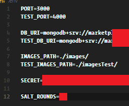

# Building Cloud Integration - Marketplace API

**Devs:** Jaakko Ikäheimo, Konsta Holm

[**API ROOT**](http://www.jikaheimo.software:3000/api) - All the documented paths are relative to this.

[**API_DOCS**](http://www.jikaheimo.software:3000/docs) - The actual documentation.

### TO RUN

1. Install dependencies with `npm install`
2. Create a **.env** file in the root folder with the following variables:
   
3. Run command `npm start` and pray that everything works.

### TO TEST

1. Follow _TO RUN_ steps 1-2.
2. Run command `npm run test` or `npm run bailtest`
